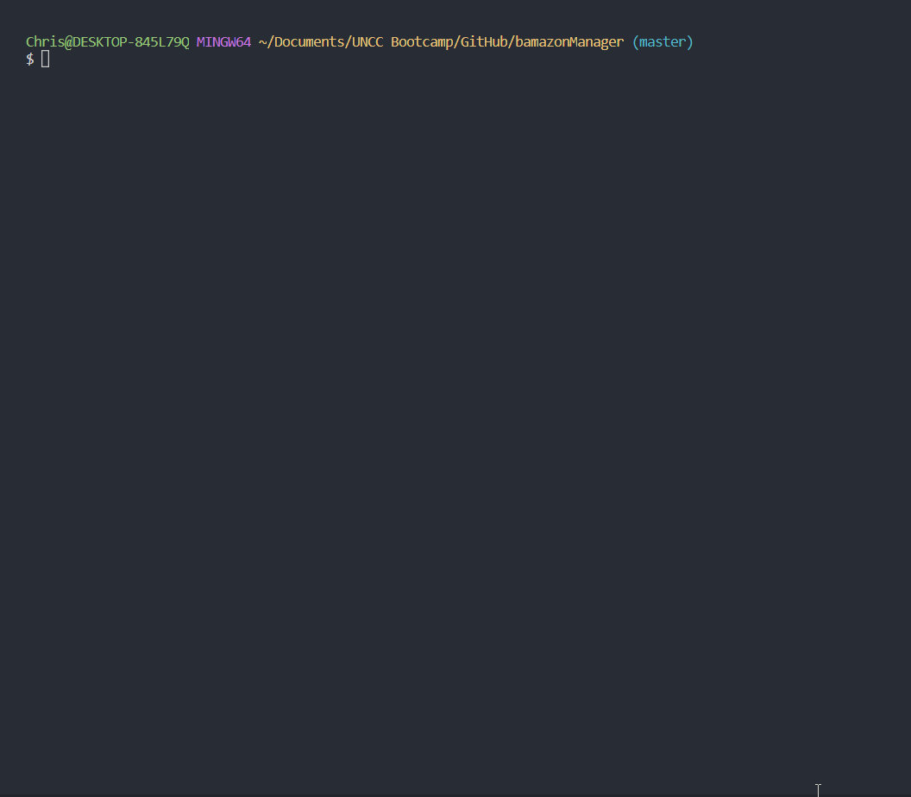

# BAMZON

Bamazon is an "e-commerce" Node command line interface application that makes use of the `npm inquirer` package and a MySQL database 
together with the `npm mysql` package. 
   
   
## Deployment

1. Open your [MySQL](https://dev.mysql.com/doc/), copy and paste the code from [bamazon_db.sql](bamazon_db.sql), and execute code to populate the database.
2. Clone this [repo](https://github.com/ChrisBoyce886/bamazon.git)
3. Naviate to the repo's root directory and run `npm install` 
4. Go into [bamazonCustomer.js](bamazonCustomer.js) and replace the MySQL password found near the top, with your own MySQL password 
5. Using command prompt run `node bamazonCustomer.js` from root directory

   
## Design Notes

* The customer interface displays to the user the current inventory of store items: item IDs, the name of the product, the department in
which the item is located, each invidiviual items price, and the quantity of that item remaining in stock. 
* The user will be prompted to select a product based on that products unique ID number. 
* Following the selection of the product, the user will be asked for the quantity of that item that he/she would like to purchase. 
  * If the selected quantity is currently in stock, the user's order is fulfilled, displaying the purchse information including 
    the total purchase price and updating the store.
   * If the ID number is not found or the requested quantity is too high, the user will be given an alert as to the nature of the error and can try again.
* Following each successful purchase, the database is updated with the new quantity amount and the user may continue shopping or can exit 
the application by pressing 'control C'
     
* **Demonstration gif:**

* This gif demonstrates how to select a product and what error could arise if selected incorrectly, as well as how to select the quanity of that product and what error arises if a quantity is too high. At the end you will see the purchase information and the updated product inventory from the database. 
   

     
## Built With

* [MySQL](https://dev.mysql.com/doc/)
* JavaScript
* [Node.js](https://nodejs.org/en/docs/)

**NPM Packages:**
  * [mysql](https://www.npmjs.com/package/mysql)
  * [Inquirer.js](https://www.npmjs.com/package/inquirer)
  * [DotEnv](https://www.npmjs.com/package/dotenv)
  
